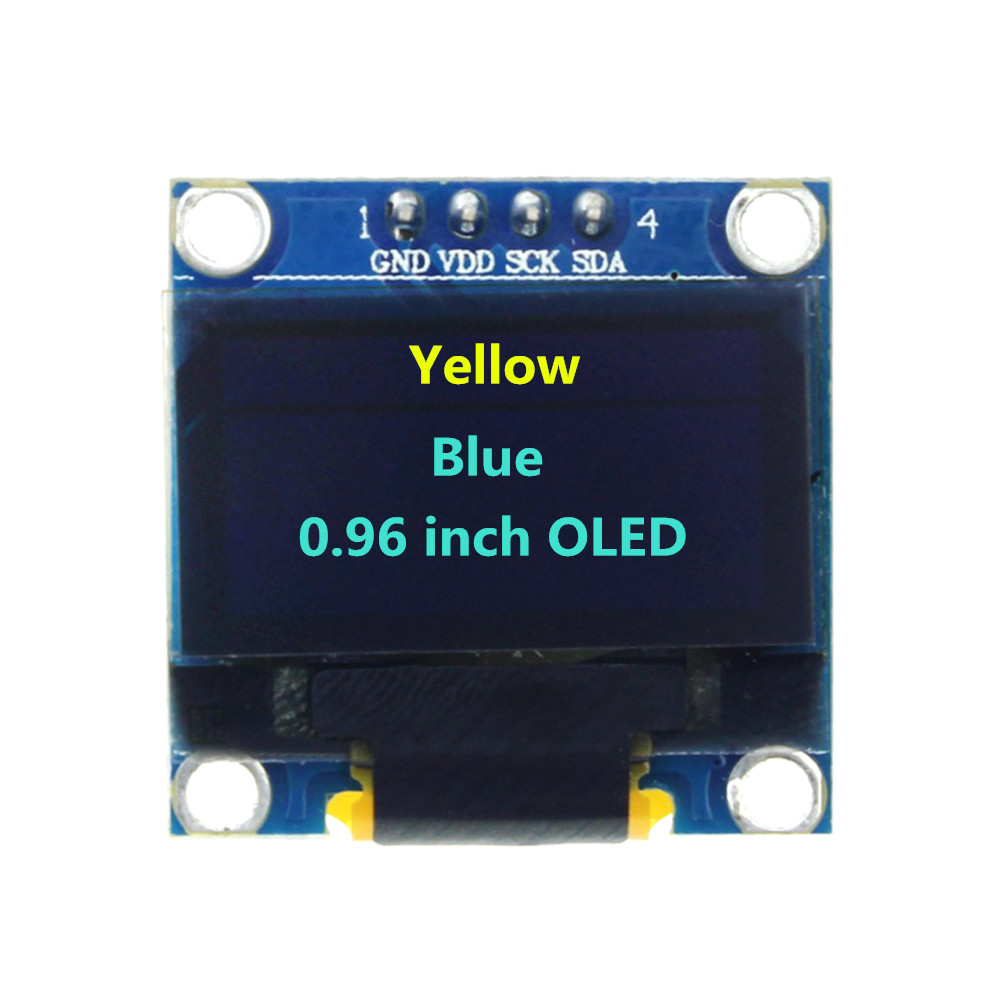

This project started off as a way to learn about a few OLEDs. Then they started multiplying. 

The saga included the following chapters: 

# Start

* I began with a bunch of motley OLEDs, ordered from a variety of sources: mostly Chinese. 

* I got one running, using an Arduino library from Adafruit. 

Here's the [code](ssd1306_128x32_i2c.ino)

* Then tried to move uptown to using a multiplexer, so I could control a bunch of OLEDs with just one Arduino. 

I ordered [this one](https://learn.adafruit.com/adafruit-tca9548a-1-to-8-i2c-multiplexer-breakout)

When the multiplexer arrived, I downloaded the Adafruit library for the multiplexer and started banging away, without immediate success (I wasn't expected it). Leo McLarty, at Fab@CIC, looked over the project, and suggested we try using an Arduino library from the [Universal 8bit Graphics Library](https://github.com/olikraus/u8g2/)

I think because an early Google search on the topic turned up [this:](https://www.brainy-bits.com/i2c-multiplexer-tca9548a/)

And then he generated [this code](LeoSketch6.ino) 

We got a few running, and then got distracted. 

To get the project restarted, a few weeks later, I tried to get a single OLED going with the U8G2 library. 

Here's my [simple sketch](HelloWorld-u8g2.ino)

I also started working with the Adafruit "Example" sketch: Making it loop, commenting on things.  

- [x]    Here's [what](SS1306_128x64_12C_v6.ino) I got running. 

Along the way, came across two excellent OLED tutorials: 

One from [Last Minute Engineers](https://lastminuteengineers.com/oled-display-arduino-tutorial/)
Here's the [code](/tutorials/lastminuteengineers-oled.ino)

And one from [Random Nerd Tutorials](https://randomnerdtutorials.com/guide-for-oled-display-with-arduino/)
Here's the [code](/tutorials/randomnerdtutorial-oled.ino)

* With 4 OLEDs attached, I started worrying about the power. I looked up the OLEDs spec sheet: they draw up to 20milleamps each. That's not much. An Arduino can handle a total of 1 amp. So I've got hundreds of milleamps to spare, right. I tried to check it on a multimeter, to confirm all this. But I didn't get very far. I played around with the continuity. And checked the voltage. But wasn't able to efficiently insert it into my circuits. Maybe later. 

# Next

-[ ] 1. Start investigating whether scrolling is possible. 

InfoTicker1.ino
Here's the [link](InfoTicker1.ino)
scrollingtest-u8g.ino
Here's the [link](scrollingtest-u8g.ino)

2. At CH, Bob Vinci suggested broadening out to eInk. I ordered this one on Adafruit. 
Here's the [link](ssd1306_128x32_i2c.ino)

3. Also ordered a new Adafruit multiplexer. So I can compare the u8g multiplexer code, and the Adafruit multiplexer code. 
