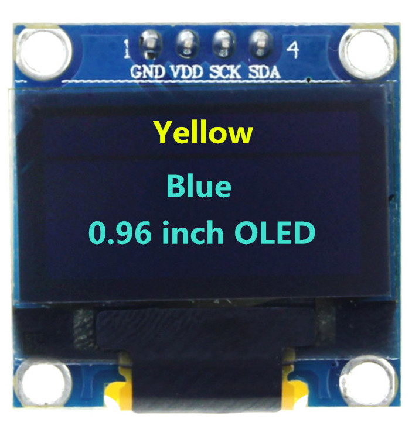

This project started off as a way to learn about OLEDs. Then it kind of grew to include a multiplexer. 

The saga included the following chapters: 

# Start

* I got started with a bunch of motley OLEDs, from a variety of sources: mostly Chinese. 

* I started off using the adafruit libraries, and got one running. 

Here's the [link](ssd1306_128x32_i2c.ino)
ssd1306_128x32_i2c.ino

* Then tried to move uptown to using a multiplexer, so I could control a bunch of OLEDs with just one Arduino. 

I think the one that arrived was this one: 

https://learn.adafruit.com/adafruit-tca9548a-1-to-8-i2c-multiplexer-breakout

Here's the [link](ssd1306_128x32_i2c.ino)
ssd1306_128x32_i2c.ino

* When Leo McLarty, at Fab@CIC, took a look at the project, he switched to U8g

Universal 8bit Graphics Library (https://github.com/olikraus/u8g2/)

https://github.com/olikraus/u8g2/

I think because an early Google search on the topic turned up this: 

https://www.brainy-bits.com/i2c-multiplexer-tca9548a/

And then he generated this code (above): 

brainybitssketch2.ino
 
We got a few running, and then got distracted. 

* To get it restarted, I tried to get one going with the U8G*2* library, recommended by the creator (the new version 2). I hate working with early, or neglected, versions of software. It's always a good feeling when you know people are still improving it, squashing bugs.  
HelloWorld-u8g2.ino

* Leo updated and commented Now LeoSketch6

* Started working with the Adafruit "Example" sketch. Making it loop, commenting things out. Got six of them. 

SS1306_128x64_12C_v6.ino

* Along the way, came across two excellent OLED tutorials. 

lastminuteengineers-oled.ino
randomnerdtutorial-oled.ino

* And starting investigating whether scrolling is possible. 

InfoTicker1.ino
scrollingtest-u8g.ino

* Also ordered a new Adafruit multiplexer. So I can compare the u8g multiplexer code, and the Adafruit multiplexer code. 

* With 4 OLEDs attached, I started worrying about the power. I looked up the OLEDs spec sheet: they draw up to 20milleamps each. That's not much. An Arduino can handle a total of 1 amp. So I've got hundreds of milleamps to spare, right. I tried to check it on a multimeter, to confirm all this. But I didn't get very far. I played around with the continuity. And checked the voltage. But wasn't able to efficiently insert it into my circuits. Maybe later. 

* At CH, Bob Vinci suggested broadening out to eInk. I ordered this one on Adafruit. 

* Evaluate the collection of old, green and black displays. These are the classic. But I couldn't get excited about them. They didn't pop at all. 
